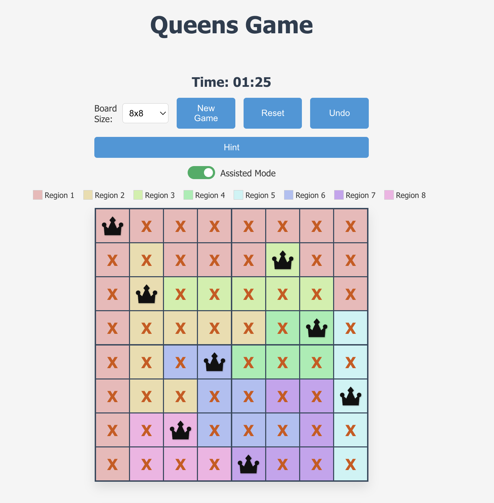
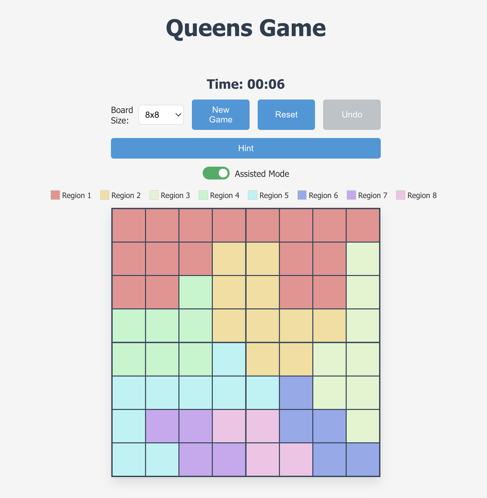
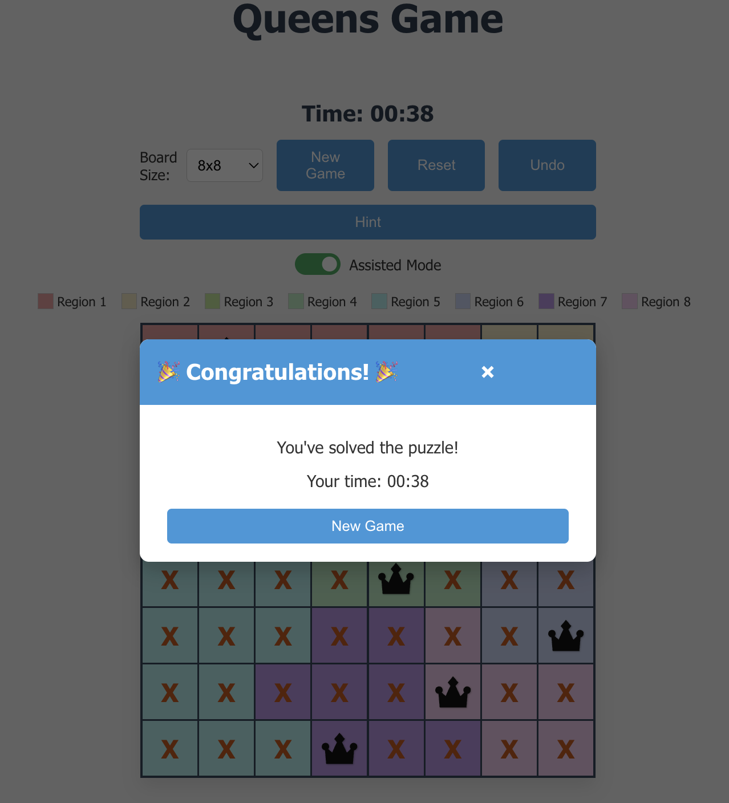

# Queens Game

Try it now: **[Play Queens Game Online](https://queensclone.vercel.app/)**

A challenging puzzle game where you place queens on a board following specific constraints.



## 🎮 Game Rules

Queens Game is a strategic puzzle game with the following rules:

- Place exactly one queen in each row, column, and colored region of the board.
- No two queens may touch—meaning no two queens can be adjacent horizontally, vertically, or diagonally.
- The game is won when all constraints are satisfied.

## ✨ Features

- **Dynamic Puzzle Generation**: Each puzzle is unique with creative region shapes (Tetris-like pieces, L-shapes, diagonal spans, etc.)
- **Guaranteed Unique Solution**: No guessing required - every puzzle can be solved through logical deduction
- **Interactive Gameplay**: Click cells to cycle through empty, marked (X), and queen states
- **Real-time Validation**: Instantly see conflicts highlighted on the board
- **Assisted Mode**: Automatically mark cells that cannot contain queens (toggle on/off)
- **Undo Feature**: Made a mistake? Easily undo your moves
- **Multiple Board Sizes**: Choose from 6x6, 8x8, or 10x10 boards
- **Hint System**: Get help when you're stuck
- **Game Timer**: Track how long it takes you to solve each puzzle
- **Responsive Design**: Play on desktop or mobile devices

## 🛠️ Installation and Setup

This project is built with React. To run it locally:

1. Clone the repository:

   ```
   git clone https://github.com/yourusername/queens-game.git
   cd queens-game
   ```

2. Install dependencies:

   ```
   npm install
   ```

3. Start the development server:

   ```
   npm start
   ```

4. Open http://localhost:3000 in your browser

## 🎯 How to Play

1. **Start a new game** by clicking the "New Game" button or changing the board size.
2. **Place queens** by clicking on cells. Each click cycles through three states:
   - Empty: No mark
   - Marked (X): Indicates a cell that can't contain a queen
   - Queen: A queen is placed on the cell
3. **Use logical deduction**:
   - Each row, column, and colored region must have exactly one queen
   - No queens can touch (including diagonally)
4. **Watch for conflicts**: Queens in conflict will be highlighted in red
5. **Win the game** by correctly placing all queens on the board

## 🧩 Implementation Details

The game includes:

- **Creative Region Generation**: Algorithm creates interesting connected region shapes with Tetris-like forms and patterns
- **Unique Solution Verification**: Ensures generated puzzles have exactly one solution
- **Conflict Detection**: Visual feedback for rule violations
- **Auto-marking System**: Optional assistance that marks cells that cannot contain queens
- **Game State Management**: Tracks board state, conflicts, and game progress

## 🔍 Puzzle Generation

The region generation algorithm:

1. Places predefined Tetris-like templates (L-shapes, T-shapes, Z-shapes, etc.)
2. Ensures all regions are connected
3. Creates patterns with varied shapes and sizes
4. Balances region sizes for fair difficulty
5. Verifies each puzzle has exactly one solution

## 🖥️ Technologies Used

- **React**: For the user interface and game state management
- **JavaScript**: Core game logic and algorithms
- **CSS**: Styling with responsive design for all device sizes

## 📱 Responsive Design

The game is designed to work well on:

- Large desktop screens
- Laptops
- Tablets
- Mobile phones

## 📷 Screenshots




## 🙏 Acknowledgments

- Inspired by the Queens Game on LinkedIn
